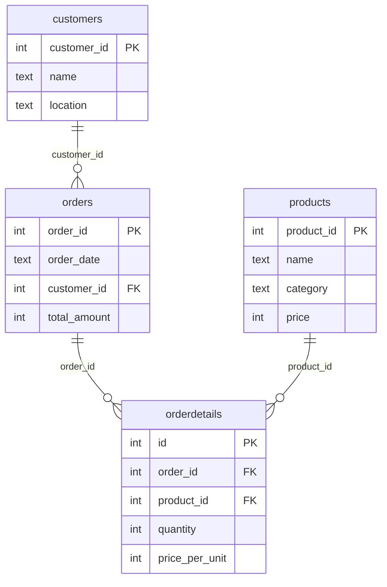

# E-commerce company: SQL Case Study
TODO:
## Dataset
TODO:


## Project structure

```
├── data/       # raw csv files
├── schema/     # raw create table statements (documentation only)
├── queries/    # one .sql file per task
└── README.md
```

Tool: MySQL 8 (Workbench).

## Tasks

### 1. idk yet


## How to run

Requires MySQL 8+ and MySQL Workbench.

1. **Create the database:**
    ```sql
    create database e_commerce_company;
    ```
2. **Import the csv files** from [data/](data/). In Workbench, right-click `e_commerce_company` -> `Table Data Import Wizard`, pick a csv, and choose `Create new table`. Repeat for each of the four files. Keep the date columns (`order_date`) as text.

TODO: do they depend on order AND INVOLVE CLEANING?

3. **Run the files in [queries/](queries/) in order** (`01_...`, `02_...`, and so on). Later queries depend on the cleaning done by earlier ones, so don't skip or reorder them.

[schema/schema.sql](schema/schema.sql) documents the raw tables as they look right after import. You don't need to run it.

To start over, drop the database and repeat from step 1.