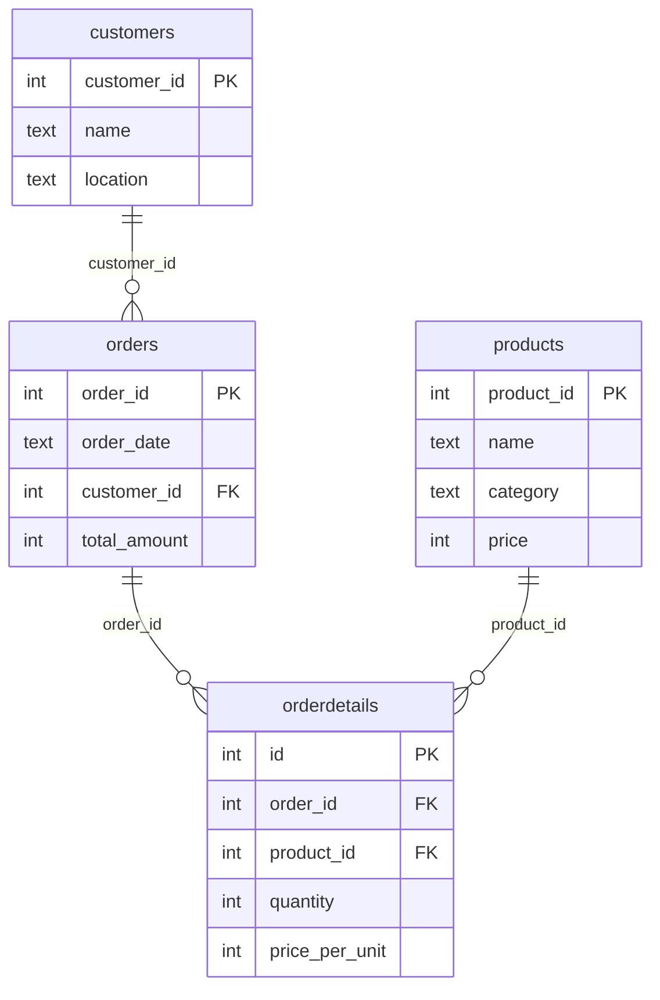

# E-commerce company: SQL Case Study
TODO:
## Dataset
TODO:


## Project structure

```
├── data/       # raw csv files
├── schema/     # raw create table statements (documentation only)
├── queries/    # one .sql file per task
└── README.md
```

Tool: MySQL 8 (Workbench).

## Tasks

### 1. Describe the tables

**Problem:** Get the structure (columns, types, constraints) of all four tables.

**Approach:** Ran `desc` on each of the four tables.

**Table structures:**

`customers`

| Field | Type | Null | Key | Extra |
|---|---|---|---|---|
| customer_id | int | NO | PRI | |
| name | text | YES | | |
| location | text | YES | | |

`products`

| Field | Type | Null | Key | Extra |
|---|---|---|---|---|
| product_id | int | NO | PRI | |
| name | text | YES | | |
| category | text | YES | | |
| price | int | YES | | |

`orders`

| Field | Type | Null | Key | Extra |
|---|---|---|---|---|
| order_id | int | NO | PRI | |
| order_date | text | YES | | |
| customer_id | int | YES | MUL | |
| total_amount | int | YES | | |

`orderdetails`

| Field | Type | Null | Key | Extra |
|---|---|---|---|---|
| id | int | NO | PRI | auto_increment |
| order_id | int | YES | MUL | |
| product_id | int | YES | MUL | |
| quantity | int | YES | | |
| price_per_unit | int | YES | | |

**Result:** All four tables confirmed with their expected columns and types, with primary and foreign keys in place across `customer_id`, `product_id`, `order_id`, and the `orderdetails` surrogate key.

Full query: [queries/01_describe_tables.sql](queries/01_describe_tables.sql)

### 2. Market segmentation analysis: top 3 cities by customer count

**Problem:** Identify the top 3 cities with the highest number of customers, to determine key markets for targeted marketing and logistics optimization.

**Approach:** Grouped `customers` by `location`, counted customers per city, sorted descending, and limited to the top 3.


| location | number_of_customers |
|---|---|
| Delhi | 16 |
| Chennai | 15 |
| Jaipur | 11 |

**Result:** Delhi leads with 16 customers, followed closely by Chennai (15) and Jaipur (11).

Full query: [queries/02_top_cities_by_customers.sql](queries/02_top_cities_by_customers.sql)

### 3. Customer engagement distribution

**Problem:** Determine how many customers fall into each order-frequency category, based on the number of orders they've placed.

**Approach:** Used a CTE to count orders placed per customer (joining `customers` and `orders` on `customer_id`), then grouped that result by order count to get the number of customers per frequency bucket, sorted ascending.

| num_of_orders | CustomerCount |
|---|---|
| 1 | 26 |
| 2 | 26 |
| 3 | 18 |
| 4 | 6 |
| 5 | 6 |
| 6 | 1 |
| 8 | 1 |

**Result:** Most customers (52) placed either 1 or 2 orders, with counts dropping off sharply beyond 3, only one customer each reached 6 and 8 orders, with no customers at 7.

Full query: [queries/03_customer_engagement_distribution.sql](queries/03_customer_engagement_distribution.sql)

### 4. Premium product trends: average quantity per order vs. revenue

**Problem:** Analyze the relationship between average purchase quantity per order and total revenue across all products, to identify which products show premium purchasing trends.

**Approach:** Grouped `orderdetails` by `product_id`, computing average quantity per order (rounded to 2 decimal places) and total revenue (`price_per_unit * quantity`), sorted by average quantity descending, with total revenue as a tiebreaker.

**Average quantity vs. revenue by product:**

| product_id | AvgQuantity | TotalRevenue |
|---|---|---|
| 6 | 2.27 | 938000 |
| 1 | 2.00 | 1620000 |
| 8 | 2.00 | 390000 |
| 3 | 1.99 | 1080000 |
| 5 | 1.98 | 595000 |
| 7 | 1.94 | 6040000 |
| 4 | 1.91 | 1560000 |
| 2 | 1.88 | 7560000 |

**Result:** No clear correlation between average order quantity and revenue, product 2 has the lowest average quantity (1.88) but the highest total revenue by far (7,560,000), while product 6 has the highest average quantity (2.27) but only mid-range revenue. Products 1 and 8 both average exactly 2.00, and the revenue tiebreaker separates them (1,620,000 vs. 390,000). High-revenue products tend to sell in smaller quantities per order rather than bulk, suggesting price point drives revenue more than purchase volume.

Full query: [queries/04_avg_quantity_per_order_vs_revenue.sql](queries/04_avg_quantity_per_order_vs_revenue.sql)

## How to run

Requires MySQL 8+ and MySQL Workbench.

1. **Create the database:**
    ```sql
    create database e_commerce_company;
    ```
2. **Import the csv files** from [data/](data/). In Workbench, right-click `e_commerce_company` -> `Table Data Import Wizard`, pick a csv, and choose `Create new table`. Repeat for each of the four files. Keep the date columns (`order_date`) as text.

TODO: do they depend on order AND INVOLVE CLEANING?

3. **Run the files in [queries/](queries/) in order** (`01_...`, `02_...`, and so on). Later queries depend on the cleaning done by earlier ones, so don't skip or reorder them.

[schema/schema.sql](schema/schema.sql) documents the raw tables as they look right after import. You don't need to run it.

To start over, drop the database and repeat from step 1.